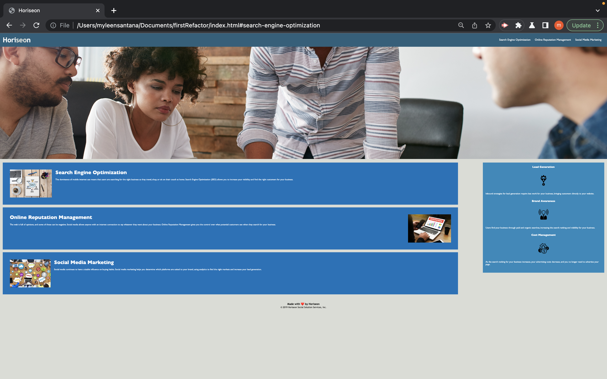

# 01 HTML, CSS, and GIT 

## Description

Code refractor is one of the most common tools devopler use in establied project. Code refactoring is a way to modify pages without disrupting the funtion of the page.

## Task

- Change "div" element and insert semantic elements 
- Comments where added to HTML file 
- Debug broken code 
- Gave pages a Title 
- Consolidated CSS code
- Created a new repo

## Usage 

